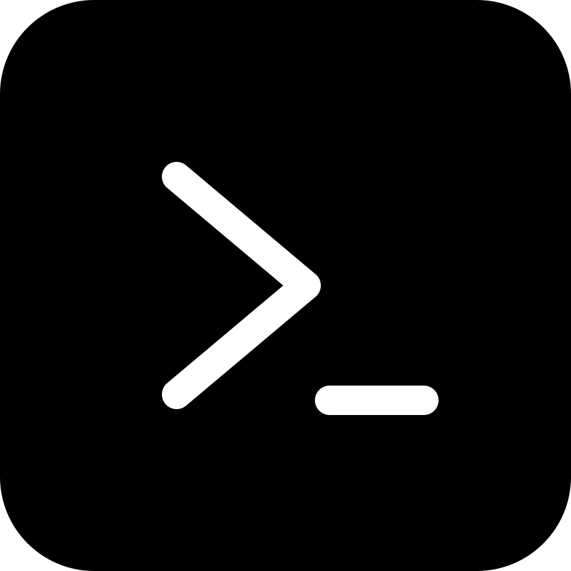

<div align="center">
  
  <h1>gray-prompt</h1>
  <p><strong>Layered global and per-project prompt customization.</strong></p>
  <p>
    <a href="https://gray.alignment.id">Website</a> ·
    <a href="https://gray.alignment.id/plugins/gray-prompt">Store</a> ·
    <a href="https://github.com/vstaln/gray-prompt">Source</a> ·
    <a href="https://github.com/vstaln/gray">gray</a>
  </p>
  <p>
    <a href="LICENSE"></a>
    <a href="https://www.rust-lang.org"></a>
    <a href="https://gray.alignment.id/plugins/gray-prompt"></a>
  </p>
</div>

<br/>

```bash
gray plugin install gray-prompt
```

Inject user-managed prompt customizations into every turn: one global file
plus one per-project file.

## What it does

On `prompt/context`, the sidecar injects every customization file that
exists, in order:

1. `~/.gray/prompt/custom.md` — global, applies to every session
   (`$GRAY_HOME` honored, `$HOME/.gray` fallback)
2. `<session.cwd>/.gray-prompt.md` — per-project

Each file is capped at 8 KiB. When nothing is found, the hook returns `{}`
and injects nothing.

`/prompt` lists what the last `prompt/context` call actually injected:
source paths and byte sizes.

## Wire methods

`plugin/manifest` · `prompt/context` (hook) · `command/run` (`/prompt`) ·
`plugin/shutdown`

## Install

```sh
gray plugin install prompt
```

## Develop

```sh
cargo test
gray account check      # entry point + manifest handshake
gray account publish    # check → build → release → publish to the gray registry
```

Bump `version` in `Cargo.toml` before each `publish`; the registry refuses to
republish a version.

## Tags

`gray` `plugin` `prompt` `rust`

---
Part of the [gray](https://github.com/vstaln/gray) plugin ecosystem —
the open-source AI agent harness. <https://gray.alignment.id>
